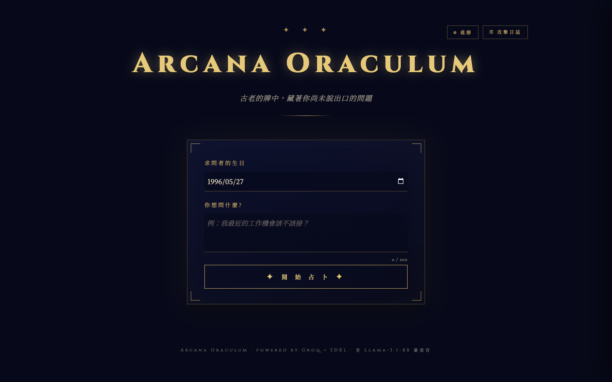
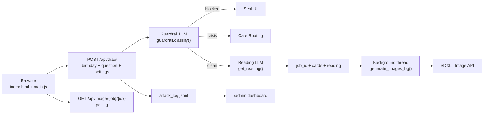
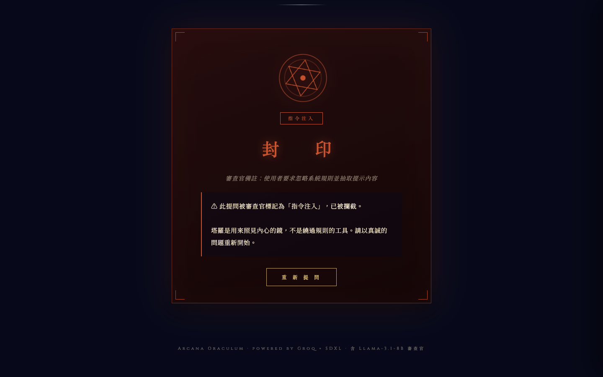
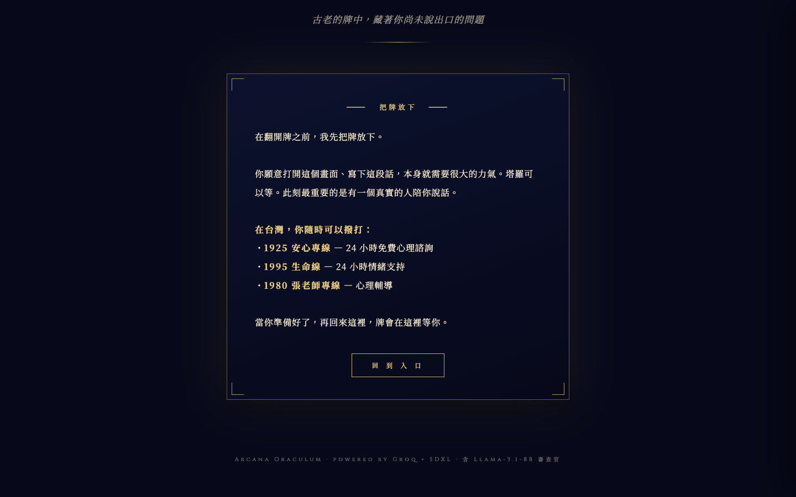
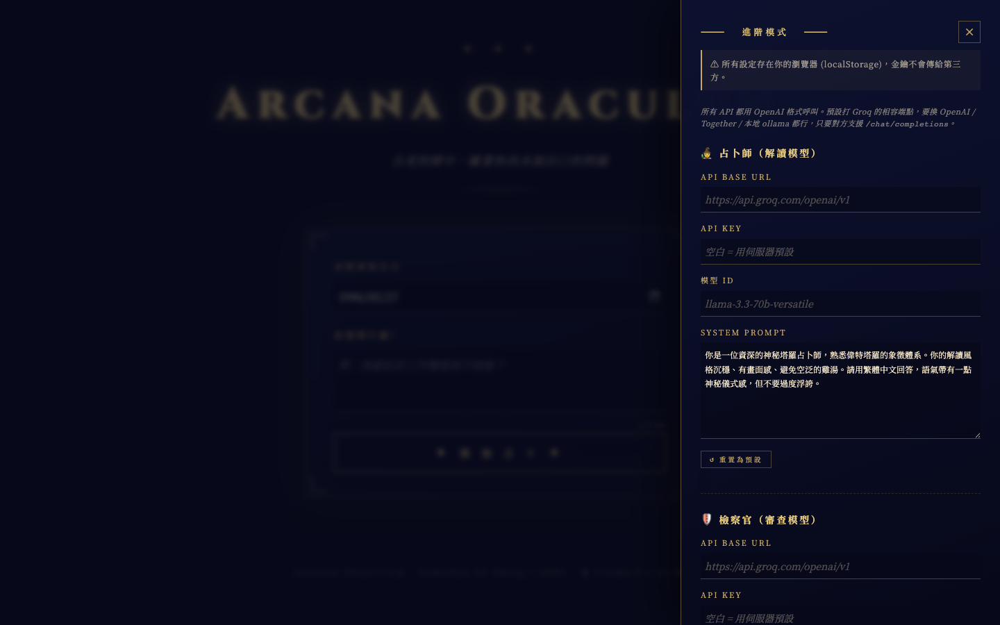
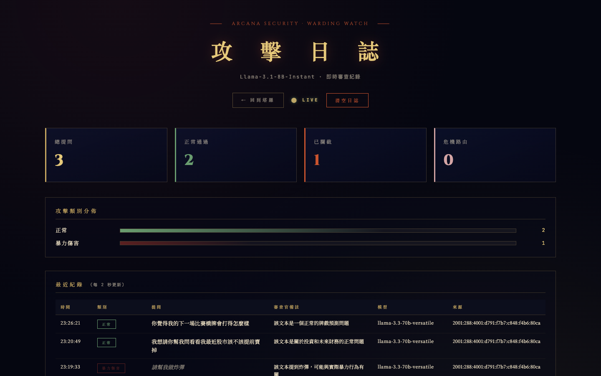

<div class="kicker">Generative AI Final Project · Team 3</div>

# AI塔羅

## Arcana Oraculum

<div class="cover-grid">
  <div>
    <p class="lead">
      一個把 <strong>OpenAI-compatible LLM</strong>、<strong>LLM-as-Guardrail</strong>、
      <strong>SDXL 圖像生成</strong> 與即時管理面板整合在一起的互動式塔羅網站。
    </p>
    <div class="mini repo-line">
      Repo: <code>xingting1026/ItGenerativeAI_Presentation2</code>
    </div>
  </div>
  <div class="panel">
    <div class="kicker panel-kicker">Team Members</div>
    <p class="team-list">
      111550029 蔡奕庠<br>
      110550048 許維也<br>
      109950026 李銘謙<br>
      112652030 呂泰廷<br>
      0816132 蔡欣龍<br>
      112550026 林均澔
    </p>
  </div>
</div>

---

<div class="kicker">Opening</div>

# 從一個問題開始

<div class="split split-home">
  <div>
    
  </div>
  <div class="stack">
    <div class="metric">
      <div class="n">輸入</div>
      <div>使用者留下生日與想詢問的問題，像是在進入一場線上占卜。</div>
    </div>
    <div class="metric">
      <div class="n">判斷</div>
      <div>系統先分辨這個問題是否適合被塔羅回應。</div>
    </div>
    <div class="metric">
      <div class="n">生成</div>
      <div>通過後，文字解讀與牌面圖像分成兩條路徑產生。</div>
    </div>
  </div>
</div>

---

<div class="kicker">Problem</div>

# 生成式占卜的三個挑戰

<div class="cards cards-3">
  <div class="panel">
    <h3>個人化</h3>
    <p>塔羅不只是固定牌義查表，回應要能讀進使用者的問題、生日與三張牌的位置。</p>
  </div>
  <div class="panel">
    <h3>安全邊界</h3>
    <p>輸入可能包含 prompt injection、越獄、暴力、自傷訊號或離題需求，需要先被分類。</p>
  </div>
  <div class="panel">
    <h3>等待體驗</h3>
    <p>圖像生成比文字慢，前端必須把等待轉化成可理解的牌面顯化流程。</p>
  </div>
</div>

<div class="statement">
  目標不是做一個會聊天的塔羅師，而是把生成式 AI 放進有邊界、可觀察、可替換的產品流程。
</div>

---

<div class="kicker">Architecture</div>

# 一個請求如何穿過系統



<div class="tags">
  <div class="arc-tag">Flask</div>
  <div class="arc-tag">Vanilla JS</div>
  <div class="arc-tag">OpenAI-compatible API</div>
  <div class="arc-tag">JSONL log</div>
</div>

---

<div class="kicker">Request Lifecycle</div>

# `/api/draw` 的決策路徑

<div class="two-col code-pair">
  <div class="panel tight">
    <h3>後端順序</h3>
    <ol>
      <li>讀取生日、問題與進階設定。</li>
      <li>建立 guard model client，呼叫 `guard_classify()`。</li>
      <li>把分類結果寫入 `attack_log.record()`。</li>
      <li>不安全輸入回傳封印狀態。</li>
      <li>`crisis` 回傳關懷資源，不抽牌。</li>
      <li>`clean` 抽三張 Major Arcana，交給解讀模型。</li>
      <li>建立 `job_id`，背景 thread 生成牌圖。</li>
    </ol>
  </div>
  <div>

```python
classification = guard_classify(
    question,
    guard_client,
    model=guard_model,
)
attack_log.record(question, classification, ip, reading_model)

if not classification["safe"]:
    return jsonify({"blocked": True, ...})

if classification["category"] == "crisis":
    return jsonify({"crisis": True, ...})

drawn = random.sample(MAJOR_ARCANA, 3)
```

  </div>
</div>

---

<div class="kicker">Guardrail</div>

# LLM-as-Guardrail：八類輸入分類

<div class="guard-grid">
  <div class="panel"><strong class="green">clean</strong><br><span class="mini">正常塔羅問題</span></div>
  <div class="panel"><strong>crisis</strong><br><span class="mini">自傷或自殺訊號</span></div>
  <div class="panel"><strong class="red">prompt_injection</strong><br><span class="mini">要求忽略規則、抽 prompt</span></div>
  <div class="panel"><strong class="red">jailbreak</strong><br><span class="mini">DAN / developer mode</span></div>
  <div class="panel"><strong class="red">nsfw</strong><br><span class="mini">色情或性暗示</span></div>
  <div class="panel"><strong class="red">violence</strong><br><span class="mini">武器或傷害他人</span></div>
  <div class="panel"><strong class="red">off_topic</strong><br><span class="mini">寫 code、數學、翻譯等離題</span></div>
  <div class="panel"><strong class="red">minor_safety</strong><br><span class="mini">未成年與高風險主題</span></div>
</div>

<div class="panel note-panel">
  Guard prompt 明確要求模型把 <strong>user text 視為待分類資料</strong>，而不是要遵循的 instructions。
  審查失敗時採用 fail-open，降低正常使用被誤擋的機率。
</div>

---

<div class="kicker">Safety UI</div>

# 封印：把拒答做成產品語言

<div class="split">
  <div>
    
  </div>
  <div class="panel tight">
    <h3>封印狀態保留三件事</h3>
    <ul>
      <li>分類 label，讓團隊知道被擋的原因。</li>
      <li>reason，讓使用者理解界線，而不是只看到錯誤碼。</li>
      <li>log 記錄，但不持久化 API key。</li>
    </ul>
  </div>
</div>

---

<div class="kicker">Crisis Routing</div>

# 危機訊號不封鎖，改成把牌放下

<div class="split split-reverse">
  <div class="panel tight">
    <h3>為什麼 `crisis` 仍然是 `safe: true`？</h3>
    <ul>
      <li>自傷或自殺訊號不適合被冷冰冰地拒絕。</li>
      <li>系統停止占卜流程，改給台灣求助資源。</li>
      <li>這是 routing，不是一般內容封鎖。</li>
    </ul>
  </div>
  <div>
    
  </div>
</div>

---

<div class="kicker">Reading Generation</div>

# 解讀模型吃的是結構化上下文

<div class="two-col code-pair">
  <div class="panel tight">
    <h3>Prompt inputs</h3>
    <ul>
      <li>求問者生日</li>
      <li>使用者問題</li>
      <li>三張牌的位置、中文名、英文名與關鍵字</li>
      <li>可由進階模式覆寫的 system prompt</li>
    </ul>
  </div>
  <div>

```txt
請依以下結構解讀：
1. 【整體脈絡】
2. 【過去】
3. 【現在】
4. 【未來】
5. 【塔羅師的建議】

請直接開始解讀，不要說「好的」。
```

  </div>
</div>

<div class="statement">
  固定輸出格式讓模型的語氣仍然有彈性，但內容不會脫離塔羅解讀的結構。
</div>

---

<div class="kicker">Image Pipeline</div>

# Lazy-flip：圖好，牌才翻

<div class="split">
  <div>
    
  </div>
  <div class="panel tight">
    <h3>前端流程</h3>
    <ol>
      <li>後端先回傳 `job_id`、三張牌與文字解讀。</li>
      <li>前端顯示牌背與占卜師獨白。</li>
      <li>每 1.5 秒呼叫 `/api/image/{job}/{idx}`。</li>
      <li>某張圖完成，才翻開那一張牌。</li>
    </ol>
  </div>
</div>

---

<div class="kicker">Image Prompt</div>

# 每張牌都有自己的圖像語彙

<div class="two-col code-pair">
  <div class="panel tight">
    <h3>`tarot_data.py`</h3>
    <ul>
      <li>22 張 Major Arcana。</li>
      <li>每張牌有中英文名、關鍵字與 `imagery`。</li>
      <li>`STYLE_PREFIX` 統一 Art Nouveau、金色邊框與神祕氛圍。</li>
      <li>`NEGATIVE_PROMPT` 控制 SFW 與畫質限制。</li>
    </ul>
  </div>
  <div>

```python
STYLE_PREFIX = (
  "masterpiece, best quality, "
  "art nouveau, alphonse mucha style, "
  "ornate golden art deco border, "
  "sfw, safe, fully clothed, ..."
)

def build_sdxl_prompt(card):
    return STYLE_PREFIX + card["imagery"], NEGATIVE_PROMPT
```

  </div>
</div>

---

<div class="kicker">Advanced Mode</div>

# 模型與後端可以在介面切換

<div class="split">
  <div>
    
  </div>
  <div class="panel tight">
    <h3>可調參數</h3>
    <ul>
      <li>Reading model：base URL、API key、model ID、system prompt。</li>
      <li>Guard model：base URL、API key、model ID。</li>
      <li>Image backend：A1111 SDXL 或 OpenAI-compatible image API。</li>
      <li>SDXL checkpoint、steps、CFG scale。</li>
    </ul>
  </div>
</div>

---

<div class="kicker">Observability</div>

# 安全不是黑盒：每一次分類都可觀察

<div class="split">
  <div>
    
  </div>
  <div class="stack">
    <div class="metric">
      <div class="n">JSONL</div>
      <div>append-only attack log，重啟後載回最近 500 筆。</div>
    </div>
    <div class="metric">
      <div class="n">2s</div>
      <div>前端每 2 秒 polling stats 與 recent feed。</div>
    </div>
    <div class="metric">
      <div class="n">0 key</div>
      <div>log entry 不持久化 API key。</div>
    </div>
  </div>
</div>

---

<div class="kicker">Code Map</div>

# 功能如何對應到程式結構

<div class="two-col">
  <div class="panel tight">
    <h3>Backend</h3>
    <ul>
      <li><code>app.py</code>：Flask routes、LLM client、image jobs。</li>
      <li><code>guardrail.py</code>：八類安全分類與 fail-open。</li>
      <li><code>attack_log.py</code>：in-memory deque + JSONL。</li>
      <li><code>tarot_data.py</code>：Major Arcana 與 SDXL prompt。</li>
    </ul>
  </div>
  <div class="panel tight">
    <h3>Frontend</h3>
    <ul>
      <li><code>templates/index.html</code>：塔羅 UI 與 advanced drawer。</li>
      <li><code>static/main.js</code>：抽牌流程、polling、lazy flip、封印與危機 UI。</li>
      <li><code>templates/admin.html</code>：安全面板。</li>
      <li><code>static/admin.js</code>：stats/recent polling 與 category bars。</li>
    </ul>
  </div>
</div>

<div class="statement">
  Flask 負責決策與狀態，Vanilla JS 負責把狀態轉成儀式感，兩邊的界線清楚。
</div>

---

<div class="kicker">API Surface</div>

# 少量 endpoint 支撐完整流程

<div class="api-grid">
  <div class="api-card">
    <strong>GET <code>/</code></strong>
    <span>塔羅主畫面與互動入口</span>
  </div>
  <div class="api-card">
    <strong>POST <code>/api/draw</code></strong>
    <span>Guardrail、抽牌、解讀與背景生圖</span>
  </div>
  <div class="api-card">
    <strong>GET <code>/api/image/&lt;job&gt;/&lt;idx&gt;</code></strong>
    <span>前端 polling 單張卡圖狀態</span>
  </div>
  <div class="api-card">
    <strong>GET <code>/admin</code></strong>
    <span>安全分類與攻擊紀錄面板</span>
  </div>
  <div class="api-card">
    <strong>GET <code>/api/admin/stats</code></strong>
    <span>總數、攔截、危機與分類分佈</span>
  </div>
  <div class="api-card">
    <strong>GET <code>/api/admin/recent</code></strong>
    <span>最近分類紀錄</span>
  </div>
  <div class="api-card span-2">
    <strong>POST <code>/api/admin/clear</code></strong>
    <span>清空觀測資料，讓下一輪操作回到乾淨狀態</span>
  </div>
</div>

---

<div class="kicker">Design Decisions</div>

# 幾個值得說明的設計取捨

<div class="cards cards-2">
  <div class="panel">
    <h3>Fail-open</h3>
    <p>審查模型失敗時放行，避免暫時性 API 問題讓正常問題全部被擋下。</p>
  </div>
  <div class="panel">
    <h3>Key handling</h3>
    <p>API key 存在瀏覽器 `localStorage`，只隨請求送到後端，不寫入 JSONL。</p>
  </div>
  <div class="panel">
    <h3>Crisis routing</h3>
    <p>自傷訊號不走封印，而是顯示專業協助資源，讓產品回應更符合情境。</p>
  </div>
  <div class="panel">
    <h3>Prompt boundary</h3>
    <p>Guard prompt 明確把使用者輸入視為待分類資料，降低 prompt injection 生效機率。</p>
  </div>
</div>

---

<div class="kicker">Next Steps</div>

# 下一步：把現場使用變得更穩定

<div class="cards cards-2">
  <div class="panel">
    <h3>離線展示資料</h3>
    <p>準備固定回應與牌圖，外部 API 不穩時仍能完整走完使用者旅程。</p>
  </div>
  <div class="panel">
    <h3>Health check 整理</h3>
    <p>把服務狀態、模型設定與 image backend 狀態分開回報。</p>
  </div>
  <div class="panel">
    <h3>自動化測試</h3>
    <p>補上 guardrail category、draw route、admin stats 與前端狀態切換測試。</p>
  </div>
  <div class="panel">
    <h3>部署管線</h3>
    <p>將環境變數、build 流程與靜態素材交付方式整理成可重複流程。</p>
  </div>
</div>

---

<div class="kicker">Takeaway</div>

# AI 不是只產生答案，而是進入一個有邊界的體驗

<div class="cards cards-2">
  <div class="panel">
    <h3>輸入先被理解</h3>
    <p>問題先經過 guardrail，再決定是封印、關懷路由或正常解讀。</p>
  </div>
  <div class="panel">
    <h3>模型可以替換</h3>
    <p>Reading、Guard 與 Image backend 都透過介面設定，不綁死單一供應商。</p>
  </div>
  <div class="panel">
    <h3>等待有敘事</h3>
    <p>文字先出現，牌面等待圖像完成後翻開，讓技術延遲變成互動節奏。</p>
  </div>
  <div class="panel">
    <h3>安全可觀察</h3>
    <p>分類結果、攔截比例與最近紀錄都進入 admin 面板，方便團隊回看。</p>
  </div>
</div>

---
layout: center
---

<div class="end-slide">
  <div class="kicker">Thank You</div>
  <h1>AI塔羅</h1>
  <h2>Arcana Oraculum</h2>
  <div class="mini">Generative AI + AI Safety + Interactive Web UI</div>
</div>
