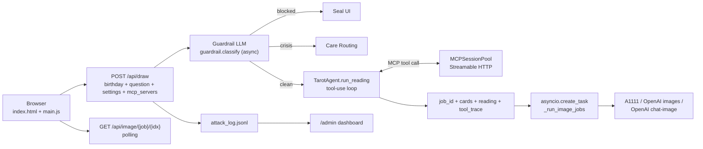

<div class="kicker">Generative AI Final Project · Team 3</div>

# AI塔羅

## Arcana Oraculum

<div class="cover-grid">
  <div>
    <p class="lead">
      一個把 <strong>OpenAI-compatible LLM</strong>、<strong>LLM-as-Guardrail</strong>、MCP、
      <strong>SDXL 圖像生成</strong> 與即時管理面板整合在一起的互動式塔羅網站。
    </p>
    <!--<div class="mini repo-line">
      Repo: <code>xingting1026/ItGenerativeAI_Presentation2</code>
    </div>-->
  </div>
  <div class="panel">
    <div class="kicker panel-kicker">Team Members</div>
    <p class="team-list">
      111550029 蔡奕庠<br>
      110550048 許維也<br>
      109950026 李明謙<br>
      112652030 呂泰廷<br>
      0816132 蔡欣龍<br>
      112550026 林均澔
    </p>
  </div>
</div>

---

<div class="kicker">Opening</div>

# 從一個問題開始

<div class="split split-home" style="margin-top: 65px;">
  <div>
    
  </div>
  <div class="stack">
    <div class="metric">
      <div class="n">輸入</div>
      <div>使用者留下生日與想詢問的問題，像是在進入一場線上占卜。</div>
    </div>
    <div class="metric">
      <div class="n">判斷</div>
      <div>系統先分辨這個問題是否適合被塔羅回應。</div>
    </div>
    <div class="metric">
      <div class="n">生成</div>
      <div>通過後，文字解讀與牌面圖像分成兩條路徑產生。</div>
    </div>
  </div>
</div>

---

<div class="kicker">Problem</div>

# 生成式占卜的三個挑戰

<div class="cards cards-3" style="margin-top: 110px;">
  <div class="panel">
    <h3>個人化</h3>
    <p>塔羅不只是固定牌義查表，回應要能讀進使用者的問題、生日與三張牌的位置。</p>
  </div>
  <div class="panel">
    <h3>安全邊界</h3>
    <p>輸入可能包含 Prompt Injection、越獄、暴力、自傷訊號或離題需求，需要先被分類。</p>
  </div>
  <div class="panel">
    <h3>等待體驗</h3>
    <p>圖像生成比文字慢，前端必須把等待轉化成可理解的牌面顯化流程。</p>
  </div>
</div>

<div class="statement">
  目標不是做一個會聊天的塔羅師，而是把生成式 AI 放進有邊界、可觀察、可替換的產品流程。
</div>

---

<div class="kicker">Architecture</div>

# 一個請求如何穿過系統
<div style="margin-top: 70px;">



<div class="tags">
  <div class="arc-tag">FastAPI · async</div>
  <div class="arc-tag">uv · Python 3.13</div>
  <div class="arc-tag">OpenAI-compatible API</div>
  <div class="arc-tag">Streamable HTTP MCP</div>
  <div class="arc-tag">Vanilla JS + Lucide</div>
  <div class="arc-tag">JSONL Log</div>
</div>

</div>

---

<div class="kicker">Request Lifecycle</div>

# `/api/draw` 的決策路徑

<div class="two-col code-pair" style="margin-top: 70px;">
  <div class="panel tight">
    <h3>後端順序</h3>
    <ol style="line-height: 1.75;">
      <li style="margin-bottom: 0.7em;">收到使用者的生日、問題與進階設定。</li>
      <li style="margin-bottom: 0.7em;">先送審查官，拿到八類安全標籤並寫進紀錄。</li>
      <li style="margin-bottom: 0.7em;">依審查官提供的結果，有以下三種路徑：
        <div style="margin-top: 0.5em;"><strong>A. 不安全</strong> → 封印頁</div>
        <div style="margin-top: 0.35em;"><strong>B.  自殺 (<code>crisis</code>)</strong> → 求助資源</div>
        <div style="margin-top: 0.35em;"><strong>C. 放行</strong></div>
      </li>
      <li>放行後抽三張 Major Arcana，交給占卜師解讀，並在背景啟動生圖。</li>
    </ol>
  </div>
  <div>

```python
classification = guard_classify(
    question,
    guard_client,
    model=guard_model,
)
attack_log.record(question, classification, ip, reading_model)

if not classification["safe"]:
    return jsonify({"blocked": True, ...})

if classification["category"] == "crisis":
    return jsonify({"crisis": True, ...})

drawn = random.sample(MAJOR_ARCANA, 3)
```

  </div>
</div>

---

<div class="kicker">Guardrail</div>

# LLM-as-Guardrail：八類輸入分類

<div class="guard-grid" style="margin-top: 120px;">
  <div class="panel"><strong class="green">clean</strong><br><span class="mini">正常塔羅問題</span></div>
  <div class="panel"><strong>crisis</strong><br><span class="mini">自傷或自殺訊號</span></div>
  <div class="panel"><strong class="red">prompt_injection</strong><br><span class="mini">要求忽略規則、輸出 System Prompt</span></div>
  <div class="panel"><strong class="red">jailbreak</strong><br><span class="mini">Admin / Developer Mode</span></div>
  <div class="panel"><strong class="red">nsfw</strong><br><span class="mini">色情或性暗示</span></div>
  <div class="panel"><strong class="red">violence</strong><br><span class="mini">武器或傷害他人</span></div>
  <div class="panel"><strong class="red">off_topic</strong><br><span class="mini">寫 Code、數學、翻譯等離題</span></div>
  <div class="panel"><strong class="red">minor_safety</strong><br><span class="mini">未成年與高風險主題</span></div>
</div>

<!--<div class="panel note-panel">
  Guard prompt 明確要求模型把 <strong>user text 視為待分類資料</strong>，而不是要遵循的 instructions。
  審查失敗時採用 fail-open，降低正常使用被誤擋的機率。
  分類靠 <strong>forced tool call</strong>（<code>tool_choice="classify"</code>）拿結構化輸出，避開 <code>response_format</code> 在 Gemini 等供應商上被忽略的問題；再退到 json_schema / json_object / 純文字四層 fallback。
</div>-->

---

<div class="kicker">Safety UI</div>

# 封印：把拒答做成產品語言

<div class="split" style="margin-top: 70px;">
  <div>
    
  </div>
  <div class="panel tight">
    <h3>封印狀態保留三件事</h3>
    <ul>
      <li><strong>分類 Label：</strong>讓團隊知道被擋的原因。</li>
      <li><strong>原因 Reason：</strong>讓使用者理解界線，而不是只看到錯誤碼。</li>
      <li><strong>紀錄 Log：</strong>記錄在日誌當中，但不紀錄 API Key。</li>
    </ul>
  </div>
</div>

---

<div class="kicker">Crisis Routing</div>

# 危機訊號不封鎖，改成把牌放下

<div class="split split-reverse" style="margin-top: 70px;">
  <div class="panel tight">
    <h3>為什麼 <code>crisis</code> 仍然是 <code>safe: true</code>？</h3>
    <ul style="line-height: 1.75;">
      <li style="margin-bottom: 0.7em;">自傷或自殺訊號不適合被冷冰冰地拒絕。</li>
      <li style="margin-bottom: 0.7em;">系統停止占卜流程，改給台灣求助資源。</li>
      <li>這是 Routing，不是一般內容封鎖。</li>
    </ul>
  </div>
  <div>
    
  </div>
</div>

---

<div class="kicker">Reading Generation</div>

# 解讀模型吃的是結構化上下文

<div class="two-col code-pair" style="margin-top: 90px;">
  <div class="panel tight">
    <h3>Prompt Inputs</h3>
    <ul style="line-height: 1.75;">
      <li style="margin-bottom: 0.7em;">求問者生日</li>
      <li style="margin-bottom: 0.7em;">使用者問題</li>
      <li style="margin-bottom: 0.7em;">三張牌的位置、中英文名、<strong>正位/逆位</strong> 與對應關鍵字</li>
      <li>可由進階模式覆寫的 System Prompt（內含區分正逆位的指示）</li>
    </ul>
  </div>
  <div>

```txt
以三牌陣抽出的牌（含正逆位）：
- 第 1 張【過去】: 愚者 (The Fool)【正位】
  — 關鍵字: 新開始、純真、冒險、自由
- 第 2 張【現在】: 高塔 (The Tower)【逆位】
  — 關鍵字: 避免災難、延後變化、害怕改變
- 第 3 張【未來】: 星星 (The Star)【正位】
  — 關鍵字: 希望、靈感、平靜、療癒

解讀時務必明確區分每張牌是正位還是逆位。
```

  </div>
</div>

<!--<div class="statement">
  每張牌 50/50 隨機正/逆位；逆位時 keywords 換成該牌的影子面，圖像在 UI 旋轉 180°，傳統塔羅做法。
</div>-->

---

<div class="kicker">Image Pipeline</div>

# Lazy-flip：圖好，牌才翻

<div class="split" style="margin-top: 70px;">
  <div>
    
  </div>
  <div class="panel tight">
    <h3>前端流程</h3>
    <ol>
      <li>後端先回傳 <code>job_id</code>、三張牌與文字解讀。</li>
      <li>前端顯示牌背與占卜師獨白。</li>
      <li>每 1.5 秒呼叫 <code>/api/image/{job}/{idx}</code>。</li>
      <li>某張圖完成，才翻開那一張牌。</li>
    </ol>
  </div>
</div>

---

<div class="kicker">Image Prompt</div>

# 每張牌都有自己的圖像語彙

<div class="two-col code-pair" style="margin-top: 100px;">
  <div class="panel tight">
    <h3><code>tarot/cards.py</code></h3>
    <ul style="line-height: 1.75;">
      <li style="margin-bottom: 0.7em;">22 張 Major Arcana。</li>
      <li style="margin-bottom: 0.7em;">每張牌有中英文名、關鍵字與 <code>imagery</code>。</li>
      <li style="margin-bottom: 0.7em;"><code>STYLE_PREFIX</code> 統一生成的圖片美術風格，金色邊框與神祕氛圍。</li>
      <li><code>NEGATIVE_PROMPT</code> 控制 SFW 與畫質限制。</li>
    </ul>
  </div>
  <div>

```python
STYLE_PREFIX = (
  "masterpiece, best quality, "
  "art nouveau, alphonse mucha style, "
  "ornate golden art deco border, "
  "sfw, safe, fully clothed, ..."
)

def build_sdxl_prompt(card):
    return STYLE_PREFIX + card["imagery"], NEGATIVE_PROMPT
```

  </div>
</div>

---

<div class="kicker">Advanced Mode</div>

# 模型與後端可以在介面切換

<div class="split" style="margin-top: 20px;">
  <div>
    
  </div>
  <div class="panel tight">
    <h3>可調參數（localStorage，無需重啟）</h3>
    <ul style="line-height: 1.75;">
      <li style="margin-bottom: 0.6em;"><strong>Reading Model：</strong>Base URL、API Key、Model ID、System Prompt。</li>
      <li style="margin-bottom: 0.6em;"><strong>Guard Model：</strong>Base URL、API Key、Model ID。</li>
      <li style="margin-bottom: 0.6em;">
        <strong>三種 Image Backend：</strong>
        <div style="margin-top: 0.4em;">1. A1111</div>
        <div style="margin-top: 0.3em;">2. OpenAI <code>/images/generations</code></div>
        <div style="margin-top: 0.3em;">3. OpenAI <code>/chat/completions</code><br>w/ <code>modalities</code>（Nano Banana 等）。</div>
      </li>
      <li><strong>MCP 工具：</strong>HTTP URL、Auth Header、逐工具勾選啟用。</li>
    </ul>
  </div>
</div>

---

<div class="kicker">Image Backends</div>

# 三種圖像 backend，同樣的介面

<div class="cards cards-3" style="margin-top: 80px;">
  <div class="panel">
    <h3>A1111 SDXL</h3>
    <p><code>/sdapi/v1/txt2img</code><br><br>本地、可控、可掛 Lightning LoRA。<br><br>支援 Negative Prompt 與 Checkpoint 切換。</p>
  </div>
  <div class="panel">
    <h3>OpenAI <code>/images/generations</code></h3><br>
    <p>標準 OpenAI 圖像端點。預設 <code>gpt-image-1</code>。<br><br>Azure / Together / Fireworks 同 schema。</p>
  </div>
  <div class="panel">
    <h3>OpenAI <code>/chat/completions</code><br>w/ <code>modalities</code></h3><br>
    <p>OpenRouter Nano Banana / Gemini 2.5 Flash Image 等。
        <!--圖在 <code>choices[0].message.images[0].image_url.url</code>。-->
    </p>
  </div>
</div>

<!--<div class="statement compact">
  共用同一個 <code>generate_image()</code> dispatcher。Creds fallback：UI 輸入 → <code>.env</code> → 寫死預設。預選 backend 由 <code>ARCANA_DEFAULT_IMAGE_BACKEND</code> 決定，可做到「沒裝 SDXL 也一鍵 demo」。
</div>-->

---

<div class="kicker">MCP Tool Use</div>

# HTTP MCP：占卜師會自己呼叫工具

<div class="two-col code-pair" style="margin-top: 70px;">
  <div class="panel tight">
    <h3>流程</h3>
    <ol style="line-height: 1.75;">
      <li style="margin-bottom: 0.8em;">使用者在 UI 新增 MCP 伺服器、勾選想開放給占卜師的工具。</li>
      <li style="margin-bottom: 0.8em;">後端連線並 <strong>重用 Session</strong>，省下每次的握手成本。</li>
      <li style="margin-bottom: 0.8em;">占卜師收到可用工具，<strong>按需要呼叫</strong>，把結果融入解讀。</li>
      <li>UI 在解讀下方展開顯示每次工具呼叫的 Input / Output。</li>
    </ol>
  </div>
  <div>

```python
from mcp import ClientSession
from mcp.client.streamable_http import (
    streamablehttp_client,
)

async with streamablehttp_client(
    url, headers={"Authorization": auth},
) as (r, w, _):
    async with ClientSession(r, w) as s:
        await s.initialize()
        tools = (await s.list_tools()).tools
        result = await s.call_tool(name, args)
```

  </div>
</div>

<!--<div class="statement compact">
  Auth header 不離開瀏覽器；工具列表與勾選狀態即時寫入 localStorage，重新整理立刻復原。
</div>-->

---

<div class="kicker">API Browser</div>

# Scalar：互動式 API 文件

<div class="two-col code-pair" style="margin-top: 70px;">
  <div class="panel tight" style="margin-top: 35px;">
    <h3>三個出口</h3>
    <ul>
      <li><code>/scalar</code>：Scalar 互動瀏覽器</li>
      <li><code>/docs</code>：Swagger UI（FastAPI 預設）</li>
      <li><code>/openapi.json</code>：規格本體，給外部 Codegen 使用</li>
    </ul>
    <!--<h3>怎麼設定</h3>
    <ul>
      <li>FastAPI 自帶 OpenAPI；Pydantic <code>Field(examples=...)</code> 自動成為 example。</li>
      <li>Tags 把 endpoints 分成 <code>tarot / mcp / admin / health</code> 群組。</li>
      <li>Scalar 從 <code>request.base_url</code> 推 server URL，反代後也可用。</li>
    </ul>-->
  </div>
  <div>

```python
from scalar_fastapi import get_scalar_api_reference

@app.get("/scalar", include_in_schema=False)
async def scalar_html(request: Request):
    base = str(request.base_url).rstrip("/")
    return get_scalar_api_reference(
        openapi_url=app.openapi_url,
        title=f"{app.title} API",
        dark_mode=True,
        telemetry=False,
        base_server_url=base,
        servers=[{"url": base, "description": "Current host"}],
    )
```

  </div>
</div>

---

<div class="kicker">Client / Server Boundary</div>

# 哪些資料在哪邊：明確劃分

<div class="cards cards-2" style="margin-top: 25px;">
  <div class="panel">
    <h3>瀏覽器 localStorage</h3>
    <ul>
      <li>使用者覆寫的 Reading / Guard / Image API Key、URL、Model</li>
      <li>MCP 伺服器 URL + Auth Header</li>
      <li>系統 Prompt 自訂</li>
    </ul>
    <br>
    <strong>隨請求送出，後端絕不寫入磁碟。</strong>
  </div>
  <div class="panel">
    <h3>後端 .env</h3>
    <ul>
      <li>Fallback：預設 LLM key、預設 Model、SDXL URL</li>
      <li>三種圖像 Backend 各自的 Base URL / Key / Model（含 Cloud）</li>
      <li><code>ARCANA_DEFAULT_IMAGE_BACKEND</code> 決定首次造訪的預選 Backend</li>
      <li>Server 設定：Host / Port / Log Level / Tool-use 上限</li>
    </ul>
    <br>
    <strong>填了 Cloud Key 就能做「沒裝 SDXL 也能一鍵 Demo」。<br><br>沒填則回到 UI 必須提供 Credentials。</strong>
  </div>
</div>

<!--<div class="statement">
  <strong>Key narrowing：</strong> 前端只送「當下選用的 Image Backend」的 Credentials。選 A1111 時 OpenAI Key 完全不離開瀏覽器。
</div>-->

---

<div class="kicker">Observability</div>

# 安全不是黑盒：每一次分類都可觀察

<div class="split" style="margin-top: 70px;">
  <div>
    
  </div>
  <div class="stack">
    <div class="metric">
      <div class="n">JSONL</div>
      <div>Append-only 攻擊紀錄，重啟後載回最近 500 筆。</div>
    </div>
    <div class="metric">
      <div class="n">2s</div>
      <div>前端每 2 秒拉取狀態。</div>
    </div>
    <div class="metric">
      <div class="n">No Key</div>
      <div>Log 不紀錄 API key。</div>
    </div>
  </div>
</div>

<!-----

<div class="kicker">Code Map</div>

# 功能如何對應到程式結構

<div class="two-col">
  <div class="panel tight">
    <h3>Backend（依 concern 分群）</h3>
    <ul>
      <li><code>app.py</code>、<code>config.py</code>：FastAPI factory、Settings。</li>
      <li><code>core/</code>：<code>llm.py</code> AsyncOpenAI factory、<code>jobs.py</code> job store。</li>
      <li><code>tarot/</code>：<code>cards / prompts / guardrail / agent / attack_log</code>。</li>
      <li><code>images/clients.py</code>：三種 backend dispatcher。</li>
      <li><code>tools/mcp.py</code>：<code>MCPSessionPool</code>（官方 SDK + AsyncExitStack）。</li>
      <li><code>api/models.py</code> + <code>api/routes/</code>。</li>
    </ul>
  </div>
  <div class="panel tight">
    <h3>Frontend</h3>
    <ul>
      <li><code>templates/index.html</code>：塔羅 UI + advanced drawer + MCP drawer + Lucide icons。</li>
      <li><code>static/main.js</code>：抽牌流程、polling、lazy flip、封印與危機 UI。</li>
      <li><code>static/mcp.js</code>：MCP 伺服器 CRUD、test、refresh、per-tool toggle。</li>
      <li><code>templates/admin.html</code> + <code>admin.js</code>：安全面板。</li>
    </ul>
  </div>
</div>

<div class="statement compact">
  FastAPI 負責決策與狀態，Vanilla JS 負責把狀態轉成儀式感，兩邊界線清楚。
</div>-->

---

<div class="kicker">API Surface</div>

# 少量 Endpoint 支撐完整流程

<div class="api-grid" style="margin-top: 55px;">
  <div class="api-card">
    <strong>GET <code>/</code></strong>
    <span>塔羅主畫面與互動入口</span>
  </div>
  <div class="api-card">
    <strong>POST <code>/api/draw</code></strong>
    <span>Guardrail、抽牌、解讀與背景生圖</span>
  </div>
  <div class="api-card">
    <strong>GET <code>/api/image/&lt;job&gt;/&lt;idx&gt;</code></strong>
    <span>前端 polling 單張卡圖狀態</span>
  </div>
  <div class="api-card">
    <strong>GET <code>/admin</code></strong>
    <span>安全分類與攻擊紀錄面板</span>
  </div>
  <div class="api-card">
    <strong>GET <code>/api/admin/stats</code></strong>
    <span>總數、攔截、危機與分類分佈</span>
  </div>
  <div class="api-card">
    <strong>GET <code>/api/admin/recent</code></strong>
    <span>最近分類紀錄</span>
  </div>
  <div class="api-card">
    <strong>POST <code>/api/admin/clear</code></strong>
    <span>清空觀測資料</span>
  </div>
  <div class="api-card">
    <strong>POST <code>/api/mcp/test</code></strong>
    <span>連線 MCP 伺服器並回傳工具列表（前端 test/refresh 共用）</span>
  </div>
  <div class="api-card">
    <strong>GET <code>/health</code></strong>
    <span>FastAPI 健康檢查（含 SDXL 連線狀態）</span>
  </div>
  <div class="api-card">
    <strong>GET <code>/docs</code></strong>
    <span>FastAPI 自動產生的 OpenAPI 文件</span>
  </div>
</div>

---

<div class="kicker">Design Decisions</div>

# 幾個值得說明的設計取捨

<div class="cards cards-2" style="margin-top: 80px;">
  <div class="panel">
    <h3>Fail-open</h3>
    <p>審查模型失敗時放行，避免暫時性 API 問題讓正常問題全部被擋下。</p>
  </div>
  <div class="panel">
    <h3>Key Handling</h3>
    <p>API Key 存在瀏覽器 <code>localStorage</code>，只隨請求送到後端，不寫入 JSONL。</p>
  </div>
  <div class="panel">
    <h3>Crisis Routing</h3>
    <p>自傷訊號不走封印，而是顯示專業協助資源，讓產品回應更符合情境。</p>
  </div>
  <div class="panel">
    <h3>Prompt Boundary</h3>
    <p>Guard Prompt 明確把使用者輸入視為待分類資料，降低 Prompt Injection 生效機率。</p>
  </div>
</div>

---

<div class="kicker">Takeaway</div>

# AI 不是只產生答案，而是進入一個有邊界的體驗

<div class="cards cards-2" style="margin-top: 80px;">
  <div class="panel">
    <h3>輸入先被理解</h3>
    <p>問題先經過 Guardrail，再決定是封印、關懷路由或正常解讀。</p>
  </div>
  <div class="panel">
    <h3>模型可以替換</h3>
    <p>Reading、Guard 與 Image Backend 都透過介面設定，不綁死單一供應商。</p>
  </div>
  <div class="panel">
    <h3>等待有敘事</h3>
    <p>文字先出現，牌面等待圖像完成後翻開，讓技術延遲變成互動節奏。</p>
  </div>
  <div class="panel">
    <h3>安全可觀察</h3>
    <p>分類結果、攔截比例與最近紀錄都進入 Admin 面板，方便團隊回看。</p>
  </div>
</div>

---

<div class="kicker">Team</div>

# 小組分工

<div class="two-col" style="margin-top: 90px;">
  <div class="panel tight">
    <h3>程式開發</h3>
    <ul style="line-height: 1.85;">
      <li style="margin-bottom: 0.5em;">109950026 李明謙</li>
      <li>111550029 蔡奕庠</li>
    </ul>
  </div>
  <div class="panel tight">
    <h3>簡報製作</h3>
    <ul style="line-height: 1.85;">
      <li style="margin-bottom: 0.5em;">110550048 許維也</li>
      <li style="margin-bottom: 0.5em;">112652030 呂泰廷</li>
      <li style="margin-bottom: 0.5em;">0816132 蔡欣龍</li>
      <li>112550026 林均澔</li>
    </ul>
  </div>
</div>

---
layout: center
---

<div class="end-slide">
  <div class="kicker">Thank You</div>
  <h1>AI塔羅</h1>
  <h2>Arcana Oraculum</h2>
  <div class="mini">Generative AI + AI Safety + Interactive Web UI</div>
</div>
